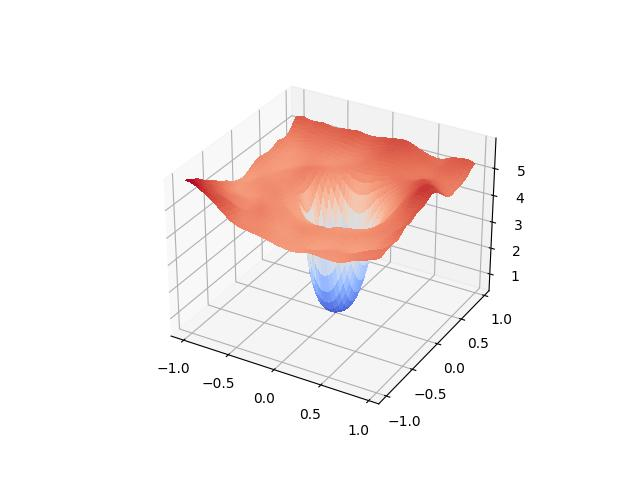

# Deep-Learning-Flower-Recognition
NTU CZ4042/SC4001 Deep Learning &amp; Neural Network Flower recognition repo. This repo build up a training pipeline of Flowers102 dataset. Our report on this assignment will also be uploaded to this repo for your reference if you are an NTU student.

## Usage
To use this repo, you must first setup your config file. We include 2 example config files in the repo for resnet50 and vit. You should have torchvision, Pytorch, and tensorboard packages in your environment. If you want to use Mixup, make sure you have the most updated Pytorch version installed. Then you can run the training script using the command

```
python train.py -c=./config.yaml\
  --tensorboard_log_path=./tf_log\
  --model_saving_path=./checkpoints
```

We also support you to train feature embedding using triplet loss and multisimilarity loss. Make sure you set the feature_extraction in your config to `True` and have faiss library installed in your environent. Then you can simply run:
```
python representation_learning.py -c=./config.yaml\
  --tensorboard_log_path=./tf_log\
  --model_saving_path=./checkpoints
```

by replacing the `train.py` to `representation_learning.py`.

## Visualization
We follow [Visualizing the Loss Landscape of Neural Nets](https://arxiv.org/abs/1712.09913) to visualize the loss landscape

You can visualize the loss landscape by including your pretrained checkpoint into the config and run:
```
python plot_3D.py -c=config.yaml
```

Example results :




## Few-shot-learning
You can do few shot learning by setting the n-shot in your config file. 

For **zero-shot classification** You can also try zero-shot learning by simply running:
```
python zsl_clip.py -c=config.yaml
```
The config file is just used for loading the dataset


## Evaluation
You can use `eval.py` to do testing on both recognition and retrieval tasks on all of your trained checkpoints by running:
```
python eval.py -c=config.yaml -p=./checkpoints
```

